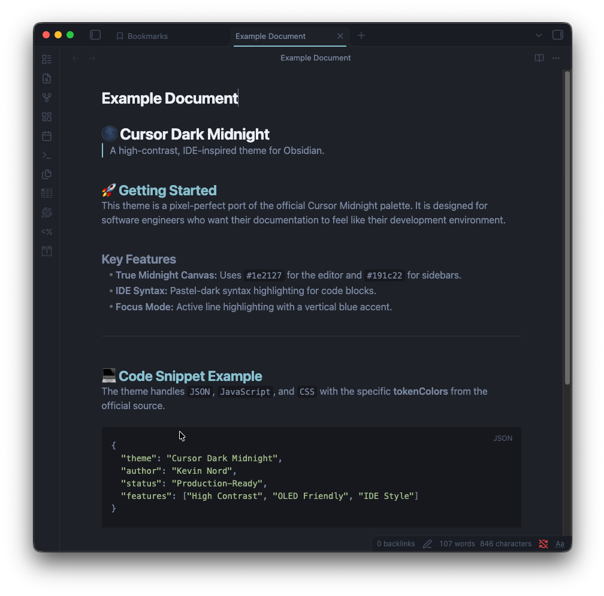

# Cursor Dark Midnight for Obsidian

A premium, high-contrast dark theme for Obsidian inspired by the **Midnight** color palette of the Cursor AI code editor. This theme provides a focused, "integrated development environment" (IDE) feel for your second brain.

## 🌑 The Midnight Aesthetic
Unlike standard dark themes that use charcoal greys, **Cursor Dark Midnight** utilizes a deep obsidian-black base (`#0b0d0f`) with vibrant syntax highlighting, making your notes pop with the clarity of a modern code editor.

## Key Features
- **True Midnight Palette:** Deep blacks and dark navy backgrounds for reduced eye strain and OLED-friendly viewing.
- **IDE-Style Layout:** Active line highlighting with a left-accent border, mimicking the focus point of Cursor/VS Code.
- **Variable-Driven Design:** Built using a robust variable system (inspired by the Nord theme structure) for consistent UI across tables, callouts, and plugins.
- **Developer-Centric UI:** Styled checkboxes, scrollbars, and sidebars that match the "Command Center" vibe of a Proxmox or UniFi dashboard.
- **Plugin Support:** Custom styling for popular plugins like **Dataview**.

## Installation

### The Easy Way (Manual)
1. Download the `theme.css` and `manifest.json` files.
2. Open your Obsidian Vault folder in your file explorer.
3. Navigate to `.obsidian/themes/`.
4. Create a new folder named `cursor-dark-midnight`.
5. Move `theme.css` and `manifest.json` into that folder.
6. In Obsidian, go to **Settings > Appearance > Themes** and select **Cursor Dark Midnight**.

## Recommended Setup
To get the exact look seen in the screenshots:
- **Font:** JetBrains Mono, Cascadia Code, or Fira Code.
- **Window Frame:** Set to `Hidden` (Settings > Appearance) for a frameless IDE look.
- **Core Theme:** Ensure Obsidian is set to **Dark Mode**.

## About the Author
**Kevin Nord**
Software engineer and creator of the *MyRestoMod* aesthetic. Designed for those who want their notes to look as sharp as their code.

---
*Disclaimer: This is an unofficial community theme and is not affiliated with Cursor.sh or VS Code.*
